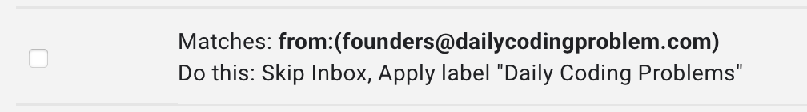

# Daily-Coding-Problem-Generator

## Motivation
To prepare for coding interviews, consistent practise is the key. However, it can be difficult to find questions to do on a daily basis. Building on the mialing list from [Daily Coding Problems](https://www.dailycodingproblem.com), I created a script that reads the problem sent to you by them, create a file based on the language you choose that comes with the question commented out!

## Pre-requisites
* A gmail account
* Knowledge of label creation and filtering would be nice
* Python3

## Set-up
1. Clone this repository.
2. Create a label 'Daily Coding Problem' in your gmail account. This label should tag all the emails sent by the mailing list.
3. Follow the settings as seen in this image for the settings of the filter

4. Follow the instructions [here](https://developers.google.com/gmail/api/guides/quickstarts-overview) to set up the Gmail api. This should also set up the necessary configuration and token json files.
5. Run `python3 problemGenerator.py`

## TODO
Create a text file that :
 - [ ] Saves the user preferred language and comment syntax
 - [ ] Create the function for the problem to be solved
